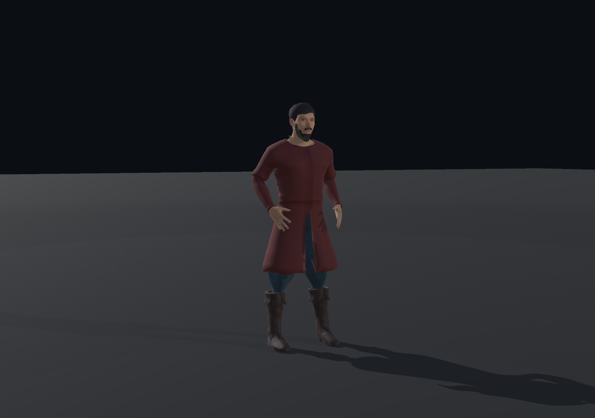
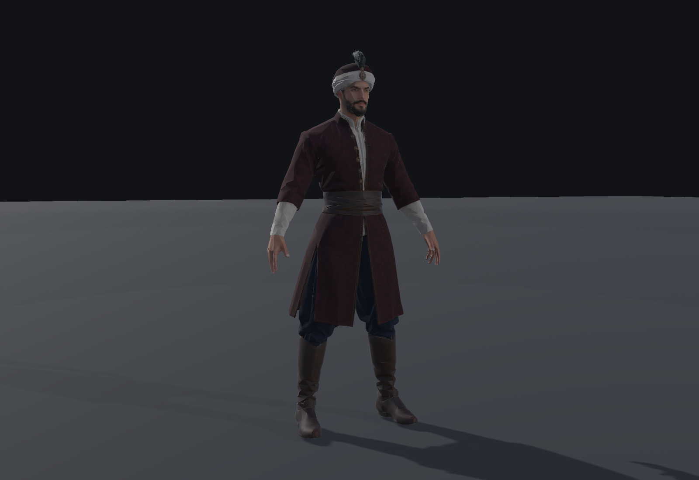

# Implementation 14C — Meshy Hasan / existing Hasan donor comparison

This is a comparison of actual Windows-player images, not concept art. The new
character is the user's Meshy Pro output; it is not a remodel of the prior donor.
The source ZIP remains unchanged. This document does not activate a production
profile or declare the complete 14C package ready.

## Images

| Previous, unaccepted Hasan donor | Meshy complete-character candidate |
| --- | --- |
|  |  |

The stages have neutral backgrounds, but resolution, framing and lighting are not
identical. The comparison is qualitative; it is not an arbitrary numeric art score.

## Visual comparison

| Area | Observation from rendered output |
| --- | --- |
| Human silhouette | Meshy has a more coherent head-to-body relationship and a clearly structured outer garment. The old donor remains recognizably human but its shoulders/coat read more like an unfinished fitted shell. |
| Historical readability | Meshy's wrapped headgear, layered front, sash and coat openings give a stronger period-inspired identity. This is not independent proof of exact 1648 Ottoman dress. |
| Face / hair / beard | Meshy offers a more distinct face and integrated beard/headgear. Neither this pilot nor the source provides facial animation; beard geometry is not independently swappable. |
| Shoulders / sleeves | The new garment has readable seams, cuffs and fabric detail, but extreme arm poses still pinch at the underarm. This requires motion-specific QA. |
| Clothing construction / waist | Layered opening, trim and sash are clearer than the previous plain coat. Body, coat, headgear and hair are one mesh, not modular clothing pieces. |
| Trousers / boots | Meshy has clearer trouser volume, cuffs and leather-like boots. Sharp ankle folds and imperfect sole contact remain visible during motion. |
| Locomotion | The actual supplied Walking and Running clips move the retained rig; no rigid sliding proxy is substituted. Foot contact is not production-approved. |
| Attack / crouch | Real Humanoid-converted FOC diagnostic motions are captured. Same-Avatar roundtrip isolates the failure to cross-Avatar reference/retarget compatibility, not missing baked curves: the slash becomes outward/high arms and crouch sinks approximately 7 cm. Visual acceptance FAIL; see the retarget audit. |
| Materials | Explicit opaque, non-emissive Standard PBR material preserves base color, metallic and inverted roughness. No invented normal map. Meshy retains more convincing cloth/leather/skin differentiation. |
| Tactical readability / LOD | Original LOD0 is 9,586 triangles; actual reduced meshes are 5,752 and 2,396. LOD1 remains close to LOD0. At the tested roughly 250-pixel character height, LOD2 preserves headgear/coat/leg silhouette, but a small bright triangle below the belt remains visible. Near facial detail is unacceptable at LOD2. Static far-view viability is supported; artifact-free motion and transition/flicker acceptance are not established. |

## Texture choice

4096, 2048 and 1024 versions are compared using the same source model and pose in
`Evidence/Implementation14C/MeshyHasanPilot/Additional/texture-*.png`.
2048 remains the default Standard material. 4096 is an inspection experiment, not
activation of the unsupported modular Narrative tier. 1024 is a texture comparison,
not a claim of a complete crowd representation. All use mipmaps/compression.

## Evidence and limits

- Required on-foot views: `Evidence/Implementation14C/MeshyHasanPilot/01-front.png`
  through `10-foc-crouch-retarget.png`.
- All sampled phases, source labels and hashes are retained in that directory's
  `Additional`, `player-evidence.json` and `capture-manifest.json`.
- No Blender viewport, Inspector image, retouching or AI image edit substitutes
  for these Windows-player captures.
- Missing `11-mounted-side.png` / `12-mounted-three-quarter.png` means NOT RUN,
  not silently passed. Mounted QA is conditional on on-foot visual acceptance.
- The raw source FBX existed in earlier Git history. The current runtime copy
  removes only duplicated embedded media; this does not rewrite old commits.

## Decision boundary

Meshy is the stronger visual candidate. A stronger static model does not satisfy
the requested pilot gate by itself. Humanoid retarget fidelity/contact, mounted
feasibility and the conditional 100-actor runtime measurement must be explicitly
resolved before PILOT PASS. Consult the final run report for the measured result;
passing import/build/unit tests alone is insufficient.

Current reviewed pilot decision: PILOT FAIL. Cross-Avatar attack intent and crouch
contact are not acceptable. Mounted fitting and 1/12/100 benchmarking are NOT RUN
because the user explicitly made them conditional on on-foot acceptance. This
does not reject the Meshy model or authorize a return to procedural clothing.
